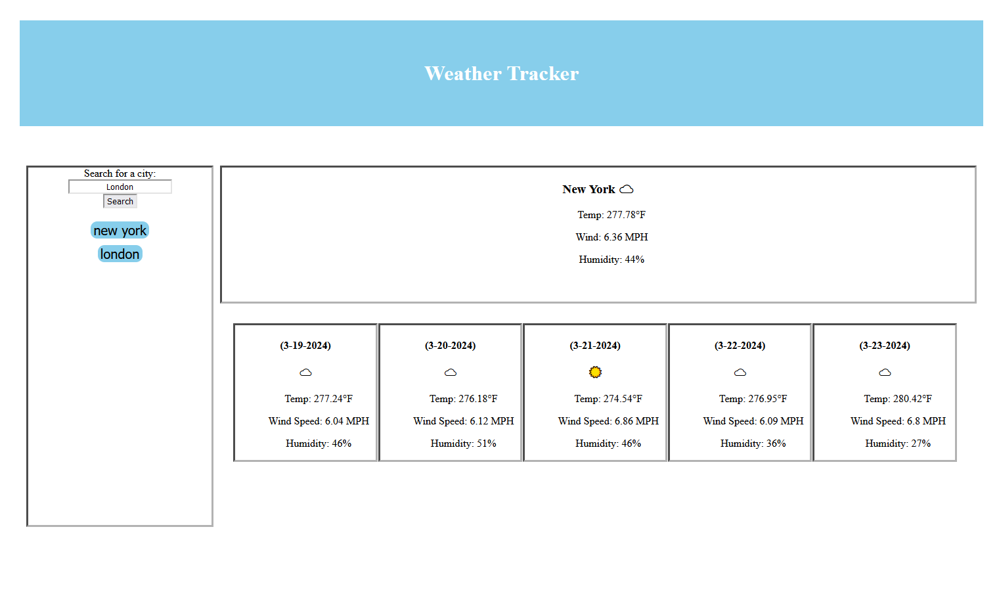

# Prework Study Guide Webpage

## Description

This is weather search page where you can search for a city, pulling up it's current forecast followed by the next five days of expected weather. Your search queries will also be saved to localStorage, allowing you to keep your search history in between sessions. Clicking these previous searches will send a fresh search, so it may be different from the last time you looked it up! This API pulls up a live forecast by the way, so it should be pretty accurate too!

This was a very frustrating project for me. Getting the server API to work wasn't as much of an issue as much as getting the search function to save, and display, the previous searches. This proved to be an exercise in frustration dealing with seemingly random and nonsensical errors that kept cropping up when I tried to inject an onclick property to a button element in HTML. I still don't know why that issue happened and while it did, unfortunately, set the project back by a bit, I am happy that the basic functionality is fully operational.

## Usage

Simply type the name of the city you'd like to know the weather for and the site will fetch the next five day weather forecast. You can then search for that same city again if under the search field, and those previous searches will stay between sessions!

## Credits

The weather API used was the 5 day weather forecast API from .
